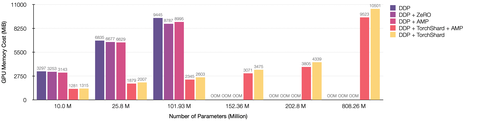

<br />
<p align="center">
  
</p>

<p align="center">
  <a href="./docs"><strong>Documents</strong></a> |
  <a href="./projects"><strong>Projects</strong></a> |
  <a href="./docs#api-references---python"><strong>API References</strong></a>
</p>

<p align="center">
  <a href="https://pypi.org/project/torchshard/">
    </a>
  <a href="https://pytorch.org/">
    </a>
  <a href="./LICENSE">
    </a>
</p>

<p align="justify">
TorchShard is a lightweight engine for slicing a PyTorch tensor into parallel shards. It can reduce GPU memory and scale up the training when the model has massive linear layers (e.g., ViT, BERT and GPT) or huge classes (millions). It has the same API design as PyTorch.
</p>

## Installation

```bash
pip install torchshard
```

More options in [INSTALL.md](./INSTALL.md).

## Usage

```python
import torchshard as ts

ts.init_process_group(group_size=2)                       # init parallel groups

m = torch.nn.Sequential(
    torch.nn.Linear(20, 30, bias=True),               
    ts.nn.ParallelLinear(30, 30, bias=True, dim=None),    # equal to nn.Linear()
    ts.nn.ParallelLinear(30, 30, bias=True, dim=0),       # parallel in row dimension
    ts.nn.ParallelLinear(30, 30, bias=True, dim=1),       # parallel in column dimension
).cuda()

x = m(x)                                                  # forward
loss = ts.nn.functional.parallel_cross_entropy(x, y)      # parallel loss function
loss.backward()                                           # backward

torch.save(
  ts.collect_state_dict(m, m.state_dict()), 'm.pt')       # save model state
```

## Performance

<p align="left">
  The following figure is a showcase of training ResNet-50 on 8 NVIDIA TITAN-XP (12196 MiB) GPUs with scaling up classes from 1000 &#8594; 1 Million.
  The input size is 224 x 224, and the batch size is 256.
  Parallelism is with 8-way data parallel and 8-way model parallel.
</p>
  
<p align="center">
  
</p>

<p align="left">
  The following figure shows training <a href="https://github.com/karpathy/minGPT">minGPT</a> on 8 NVIDIA TITAN-XP (12196 MiB) GPUs with scaling up parameters from 10 Million &#8594; 808 Million.
  The input size is 32 x 32, and the batch size is 16.
  Parallelism is with 1-way data parallel and 8-way model parallel.
</p>
  
<p align="center">
  
</p>

## Contributing

The TorchShard welcomes your expertise and enthusiasm!

If you are interested in torchshard, you are welcome to help

- polish code and develop new features
- develop high-quality tutorials, projects, and advanced materials

Direct pull requests are welcome. Contact: kaiyuyue [at] umd.edu.

## Citing TorchShard

If you think TorchShard is helpful in your research and consider to cite it, please use the following BibTeX entry.

```BibTeX
@misc{torchshard2021,
  author =       {Kaiyu Yue},
  title =        {TorchShard},
  howpublished = {\url{https://github.com/KaiyuYue/torchshard}},
  year =         {2021}
}
```
