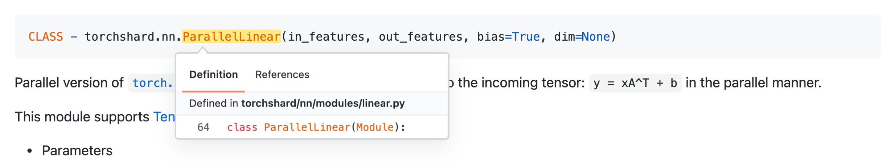

# Documents

This page holds the full TorchShard documents, including notes, tutorials, and API references.
Every tutorial has its corresponding code example in [projects](../projects/).

## Contents

- Notes
    - [About TorchShard](./note/about.md)
    - [Development](./note/dev.md)
- Tutorials
    - [Large-Scale Parallel Training on ImageNet](./tutorial/in1k.md)
    - [TorchShard Meets AMP and ZeRO](./tutorial/amp.md)
    - [Building Customized Parallel Layer and Loss for Face Recognition](./tutorial/face.md)
    - [Parallelizing Transformer to Scale-up minGPT Training](./tutorial/mgpt.md)

## API References - Python

- [torchshard](./api/ts.md)
- [torchshard.nn](./api/nn.md)
- [torchshard.distributed](./api/dist.md)

To review the API source code, move your mouse on the API and click it, like this:

  

