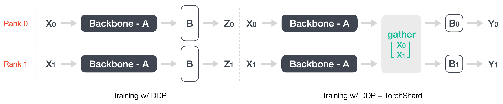
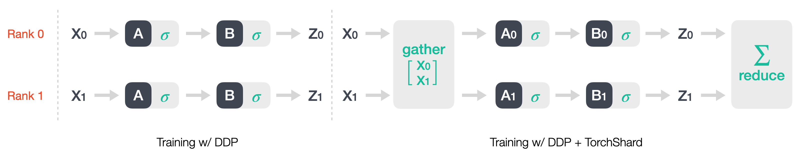
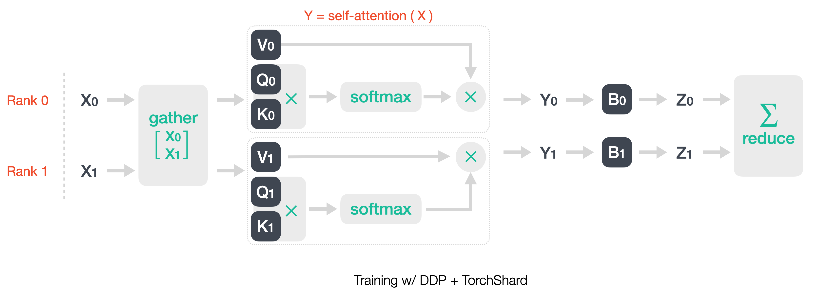
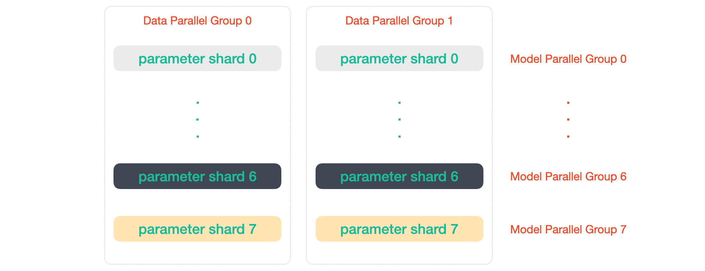

# About TorchShard

This note answers three typical questions about TorchShard -
Why is it? What is it? And How does it work?

## Why Is TorchShard?

Training super large models, such as BERT and GPT, is trending in Natural Language Processing (NLP) applications.
One of the biggest problems for training such large models is memory constraints.
To crack this nut, [Megatron-LM](https://github.com/NVIDIA/Megatron-LM) and [PyTorch-Lightning](https://pytorch-lightning.readthedocs.io/en/stable/advanced/multi_gpu.html#sharded-training) uses model parallelism to scale up the training.
However, Megatron-LM only focuses on training language models at scale.
PyTorch-Lightning is only based on sharded optimizer states and gradients like [DeepSpeed](https://github.com/microsoft/DeepSpeed).

In the computer vision tasks, the same problem could also be encountered, for example, training huge transformer-based models or training a model within millions of classes.
These vision tasks could also benefit from model parallelism.
However, a standard library doesn't exist yet to adopt model parallelism as easily as adopting other state-of-the-art (SOTA) techniques such as mixed-precision.

Therefore, TorchShard aims to:
- be a standard PyTorch extensive library for scaling up training with model parallelism.
- be used in an easy and natural PyTorch way. There is a [discussion](https://github.com/microsoft/DeepSpeed/issues/704) on this point.

## What Is TorchShard?

TorchShard is a ground-up rewrite of the [model parallel unit](https://github.com/NVIDIA/Megatron-LM/tree/main/megatron/mpu) (mpu) - the core of [Megatron-LM](https://github.com/NVIDIA/Megatron-LM).
[FairScale](https://github.com/facebookresearch/fairscale) also forks mpu to extend its training capabilities with other SOTA extensions (Shard Data Parallel and ZeRO).
However, it still integrates the mpu as an inner library and lacks documents to illustrate how to use it.
In contrast, TorchShard has both documents and tutorials.

More than anything, TorchShard has the same API design as PyTorch, which means that all the sub-classes and sub-functions keep the same as those of PyTorch.
For example, if you would like to make the original linear layer `torch.nn.Linear(in_features, out_features, bias=True)` parallel, change `torch` into `ts`, and call the sub-class `nn.ParallelLinear` with a `dim` parameter.
It looks like:

```python
import torch
import torchshard as ts

m = torch.nn.Linear(20, 30, bias=True)

m = ts.nn.ParallelLinear(20, 30, bias=True, dim=1)    # parallel in column dimension
m = ts.nn.ParallelLinear(20, 30, bias=True, dim=0)    # parallel in row dimension
m = ts.nn.ParallelLinear(20, 30, bias=True, dim=None) # equal to torch.nn.Linear()
```

Besides, TorchShard supports all kinds of features for working with DDP, handling the cases of saving and loading shard checkpoints, initializing shard parameters, and playing with tensors across multiple machines and GPUs.
Specifically, 
- [torchshard](../api/ts.md) contains basic functions and operations, like [torch](https://pytorch.org/docs/stable/torch.html) package.
- [torchshard.nn](../api/nn.md) contains basic building blocks for graphs, like [torch.nn](https://pytorch.org/docs/stable/nn.html) package. 
- [torchshard.nn.functional](../api/nn.md) - contains corresponding functional ops of **torchshard.nn**, like [torch.nn.functional](https://pytorch.org/docs/stable/nn.functional.html) package.
- [torchshard.distributed](../api/dist.md) contains basic functions for processing distirbuted tensors and groups. 
It is easier to be used than [torch.distributed](https://pytorch.org/docs/stable/distributed.html) package.

More details can be found in [API Documents](..).

## How Does TorchShard Work?

The best material about model parallelism is Megatron-LM paper [[arXiv](https://arxiv.org/abs/1909.08053)].
In this section, we illustrate the TorchShard usage principle for different kinds of architecture.

### Review of Parallel Mechanism

The fundamental operation in a model graph is [General Matrix Multiplication](https://en.wikipedia.org/wiki/Matrix_multiplication) (GEMM).
We can define it with a bias as `y = xW^T + b`, where `x` is input tensor in **R**^`[N, C]`, `W` is weight parameter in **R**^`[M, C]`, `b` is a bias in **R**^`[M]`.
There are two ways to parallelize GEMM operation.

The first option is to split its weight `W` along the row axis, `W = [W1 W2]^T`.
This method also needs to split the input along the column axis, `x = [x1 x2]`.
The final result is `y = (x1W1^T + x2W2^T) + b`.

The second option is to split its weight `W` along the column axis, `W = [W1 W2]`.
This method also needs to split the bias along the column axis, `b = [b1 b2]`.
The final result is `y = [y1 y2] = [(xW1^T + b1) (xW2^T + b2)]`.

### Working With DDP

Data parallel strategy is in default used in our practical training.
Here we assume there are two [distributed data parallel](https://pytorch.org/docs/stable/notes/ddp.html?highlight=ddp) (DDP) process groups and two ranks.
We set the same number for torchshard process groups, which means that the target tensor will be sliced into two shards, each shard will be on different ranks.
To let parallel layers see all the batched data (or features), we need to gather data (or features) along the row axis (equivalent to the batch axis) before feeding them into the first parallelized layer.

### In Classification Architecture

<p align="center">
</img>
<br>Figure 1. DDP and DDP + TorchShard in classification model architecture.
</p>

As shown in Figure 1, combining a feature backbone and a fully-connected (FC) layer is common in classification tasks.
Here we consider parallelizing tensors for the fully-connected layer.
In the above figure, DDP makes two ranks stream different batched data `x0` and `x1`,
and meanwhile keep the same parameters `A` for the backbone and `B` for the FC layer.
The network outputs will be `z0 = (x0A^T)B^T` and `z1 = (x1A^T)B^T`.
Then DDP kicks off updating the whole network parameters at the `loss.backward()` step by all-reducing loss scalars (`loss(z0)` and `loss(z1)`) across ranks.

Before feeding backbone features (indicated by `x0` and `x1` to make it easy) into the parallel FC layer, we gather them along the batch axis `x = [x0 x1]^T`.
Then we can adopt one parallelism option, e.g., column-parallel one, for the last FC layer.
The simple demonstration for using DDP with TorchShard is illustrated in the above figure.
The FC layer is parallelized in column dimension, `y = [y0 y1] = [xB0^T xB1^T]`.
After calling `loss.backward()`, DDP is only responsible for updating parameters that are shared with ranks.
The parameters of parallelized layers are updated locally in their ways.

### In Transformer Module

Transformer constains two sub-modules: multi-layer perceptron (MLP) block and self-attention block.

<p align="center">
</img>
<br>Figure 2. DDP and DDP + TorchShard in MLP block.
</p>

The MLP block with stacking multiple linear layers, is easy to perform model parallel technique.
As shown in Figure 2, in a two-layer MLP block, the first linear layer is parallelized in column dimension, 
and the second layer is parallelized in row dimension.
In DDP + TorchShard training mode, the batched data is gathered `x = [x0 x1]^T` before passing through the MLP block.
Then the first column-parallel layer outputs `y = [y0 y1] = [xA0^T xA1^T]`.
Now `y` is sliced into `y0` on rank 0 and `y1` on rank 1.
Since the second row-parallel layer needs input to be parallel in the column, it can directly calculate output `z0 = y0B0^T` and `z1 = y1B1^T`.
In the end, the final output can be all-reduced with SUM operation across ranks `z = (z0 + z1) = (y0B0^T + y1B1^T)`.

<p align="center">
</img>
<br>Figure 3. DDP + TorchShard in self-attention block.
</p>

The self-attention block, as shown in Figure 3, is the basic module for building transformer-based models.
We can parallelize it in the same way as doing for the MLP block. 
In the self-attention block, all three linear layers are parallelized in the column axis, i.e., 
`self-attention weights = {Q, K, V} = {[Q0 Q1], [K0 K1], [V0 V1]}`.
And the last linear layer is in the row parallel `B = [B0 B1]^T` to fire the final block output 
`z = (z0 + z1) = (y0B0^T + y1B1^T)`.

### Gathering Is Expensive

If there are only several linear layers in the model, e.g., classification architecture, it's ok to gather input tensors.
But if there are massive linear layers, such as GPT, gathering tensors is not optimal for large-scale training.
Gathering tensors from multiple parallel groups or ranks is expensive.
This operation will cost more time in every training iteration.
Moreover, it also hinders the model parameters growth if we want to train a super large model.
Fortunately, data parallel and model parallel are orthogonal to each other, erasing gathering operation in training.
For example, there are two machines, and each machine has 8 GPUs.
We treat each machine as a single node with 8 ranks, i.e., world size is 2, each world has 8 ranks.
We can make 2 data parallel groups and 8 model parallel groups, as shown in the following figure.

<p align="center">
</img>
<br>Figure 4. 2 data parallel groups and 8 model parallel groups.
</p>

In each data parallel group, the batched data is same but parameters are different.
In each model parallel group, the batched data is different but parameters are same.
So this orthogonal property can help us avoid gathering and achieve more efficient training.

## References

- B. Lefaudeux, et al. FairScale: PyTorch Extensions For High Performance And Large Scale Training, 2020. [[Github](https://github.com/facebookresearch/fairscale)]
- S. Rajbhandari, et al. ZeRO: Memory Optimizations Toward Training Trillion Parameter Models, 2019. [[arXiv](https://arxiv.org/abs/1910.02054)] [[Github](https://github.com/microsoft/DeepSpeed)]
- M. Shoeybi, et al. Megatron-LM: Training Multi-Billion Parameter Language Models Using Model Parallelism, 2019. [[arXiv](https://arxiv.org/abs/1909.08053)] [[Github](https://github.com/NVIDIA/Megatron-LM)]
- J. Rasley, et al. DeepSpeed: System Optimizations Enable Training Deep Learning Models with Over 100 Billion Parameters, 2020. [[Webpage](https://www.deepspeed.ai/)] [[Github](https://github.com/microsoft/DeepSpeed)]
- W. Falcon, et al. PyTorch-Lightning: The Lightweight PyTorch Wrapper For High-performance AI Research, 2019. [[Github](https://github.com/PyTorchLightning/pytorch-lightning)]
- N. Shazeer, et al. Mesh TensorFlow: Model Parallelism Made Easier, 2018. [[arXiv](https://arxiv.org/abs/1811.02084)] [[Github](https://github.com/tensorflow/mesh)]

<p><br/></p>

<p>&#10141; Back to the <a href="../">main page</a></p>
