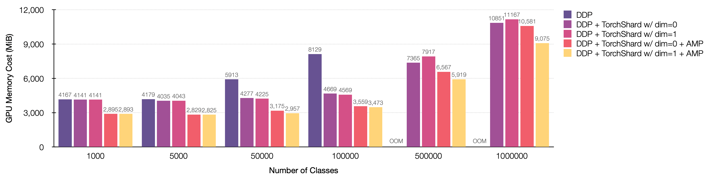
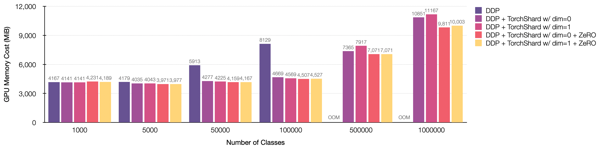

# TorchShard Meets AMP and ZeRO

[[`projects/imagenet`](../../projects/imagenet)][[`projects/arcface`](../../projects/arcface)]

TorchShard works with PyTorch Automatic Mixed Precision (AMP) and ZeRO techniques in a natural way. :leaves:

## TorchShard + AMP

Please refer to the PyTorch AMP tutorial [All together: “Automatic Mixed Precision”](https://pytorch.org/tutorials/recipes/recipes/amp_recipe.html#all-together-automatic-mixed-precision).
In our project code, it looks like this.

```python
# args: --enable-amp-mode

# gradscaler
scaler = torch.cuda.amp.GradScaler(enabled=args.enable_amp_mode)

with torch.cuda.amp.autocast(enabled=args.enable_amp_mode):
    # compute output
    output = model(images)

    if args.enable_model_parallel:
        target = ts.distributed.gather(target, dim=0)
    loss = criterion(output, target)

# compute gradient and do SGD step
scaler.scale(loss).backward()
scaler.step(optimizer)
scaler.update()
optimizer.zero_grad()
```

The following figure shows GPU memory cost with the standard ResNet training settings (i.e., input size 224 and batch size 256) under different parallel strategies and AMP.

- Training ResNet-50 on 8 NVIDIA TITAN-XP (12196 MiB) GPUs.

<p align="center">
  
</p>

## TorchShard + ZeRo

ZeRo is the core of [DeepSpeed](https://github.com/microsoft/DeepSpeed). 
Please refer to the PyTorch distributed optimizer [ZeroRedundancyOptimizer](https://pytorch.org/docs/master/distributed.optim.html?highlight=zero#torch.distributed.optim.ZeroRedundancyOptimizer).
It will come with PyTorch >= 1.9.0.
If you would like to test this function, please install the nightly build version to run the script.

```python
# args: --enable-zero-optim

from torch.distributed.optim import ZeroRedundancyOptimizer

if args.enable_zero_optim:
    print('=> using ZeroRedundancyOptimizer')
    optimizer = torch.distributed.optim.ZeroRedundancyOptimizer(
        model.parameters(),
        optimizer_class=torch.optim.SGD,
        lr=args.lr,
        momentum=args.momentum,
        weight_decay=args.weight_decay)
else:
    optimizer = torch.optim.SGD(model.parameters(), args.lr,
                                momentum=args.momentum,
                                weight_decay=args.weight_decay)
```

The following figure shows GPU memory cost with the standard ResNet training settings (i.e., input size 224 and batch size 256) under different parallel strategies and ZeRO optimizer.

- Training ResNet-50 on 8 NVIDIA TITAN-XP (12196 MiB) GPUs.

<p align="center">
  
</p>


<p><br/></p>

<p>&#10141; Back to the <a href="../">main page</a></p>
