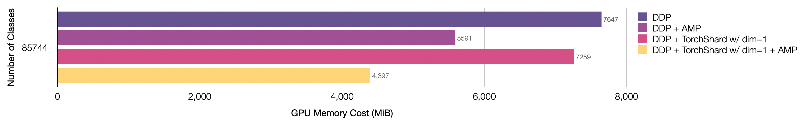
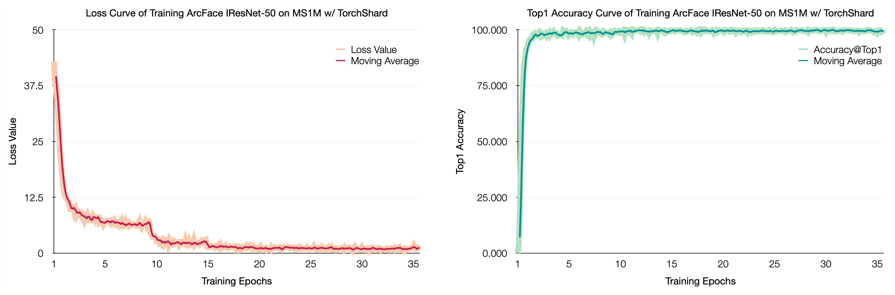
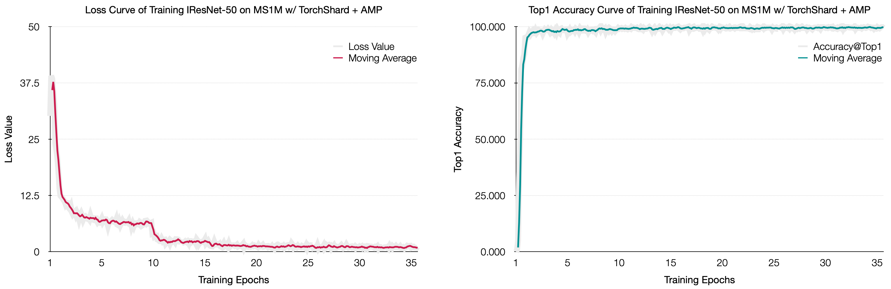

# Build Customized Parallel Layer and Loss for Face Recognition

[[`projects/arcface`](../../projects/arcface)]

This note will show you how to make your customized layer and loss parallel using `torchshard`.
Here we take the case of training an [ArcFace](https://arxiv.org/abs/1801.07698) model as our example.

In the note of [Large-scale Classification on ImageNet](imagenet.md), we have already introduced how to initialize process groups, convert models, build loss function, and save or load checkpoints.
Besides, we have walked through the steps for using torchshard with AMP and ZeRo techniques in [TorchShard Meets AMP and ZeRO](../amp.md).
Therefore, this note only focuses on how to build customized parallel layers and losses. :yarn:

## Templates

Under the TorchShard [projects](../../projects) directory, there is a [templates](../../projects/templates) folder. 
This folder supplies the code template and essential components for writing parallel stuff.

Copy the template files and change their filenames:

```bash
# under the projects directory
mkdir arcface && cd arcface
cp ../templates/torchshard_layer.py arcface_linear.py
cp ../templates/torchshard_loss.py arcface_loss.py
```

## Naive Implementation

First, let's take a look at a [PyTorch ArcFace implementation](https://github.com/ronghuaiyang/arcface-pytorch/blob/master/models/metrics.py#L10-L53).
ArcFace contains two parts: a particular linear layer and a cross-entropy loss.
Its particular linear layer needs target input to build a one-hot matrix.
We move this part to the loss function to make sure the linear layer has clean inputs (without target).

The naive ArcFace forward code is at the [`_forward`](../../projects/arcface/arcface_linear.py#L118) of `arcface_linear.py`.

## Build Parallel Layers

There are two parallel types - along the column and row axis.
Ideally, we could implement these two types of ArcFace linear like `torchshard.nn.ParallelLinear()`. 
However, since the ArcFace linear needs to normalize the feature input and weight parameter, it's a little tricky to parallelize ArcFace in row dimension (this needs to write a new normalization function).
So, to make it easy and simple, we ignore its row dimensional parallel forward. 
We write the code for its column-parallel type.
The forward flow is the same as the naive forward function.
Just remember to set the TorchShard attribute for outputs using `torchshard.set_attribute()` function.

The complete forward code looks like the [`_col_parallel_forward`](../../projects/arcface/arcface_linear.py#L102) of `arcface_linear.py`.

## Build Parallel Losses

We should handle the corresponding ways of making the one-hot matrix for different parallel types (within None and column dimension).
Then we feed the output logits into the general cross-entropy loss function.
The `torchshard.nn.functional.cross_entropy()` function can choose the right way to calculate forward and backward according to its input.

The complete loss code is at the [`arcface_loss.py`](../../projects/arcface/arcface_loss.py).

## Backbone

The ArcFace backbone is [IResNet](https://github.com/deepinsight/insightface/blob/master/recognition/arcface_torch/backbones/iresnet.py).
Here we add our `arcface_linear.ParallelArcLinear()` to the iresnet, as the follwoing:

```python
from arcface_linear import ParallelArcLinear
self.arcface_linear = ParallelArcLinear(
    num_features,
    num_classes,
    dim=parallel_dim
)
self.enable_model_parallel = enable_model_parallel
```

And don't forget gathering input for the parallel layer.

```python
if self.enable_model_parallel:
    x = ts.distributed.gather(x, dim=0)
x = self.arcface_linear(x)
```

The complete code is [iresnet.py](../../projects/arcface/iresnet.py). 
Then in our [`main.py`](../../projects/arcface/main.py), we build our model like:

```python
import iresnet
print("=> creating model '{}'".format(args.arch))
model = iresnet.__dict__[args.arch](
    num_classes=args.num_classes,
    enable_model_parallel=args.enable_model_parallel,
    parallel_dim=args.model_parallel_dim
)
if args.model_parallel_dim is not None:
    # register parallel parameters to let DDP ignore
    ts.register_ddp_parameters_to_ignore(model)
```

**Please pay attention to the step of letting DDP ignore the parallel parameters**.
TorchShard offers a function [`torchshard.register_ddp_parameters_to_ignore()`](../api/ts.md#register_ddp_parameters_to_ignore) to make this step easy with one line code.
But this function only works with PyTorch >= 1.8.0.
If you insist on using PyTorch < 1.8.0, you need to reconstruct the code to make sure DDP does not wrap the parallel layers.

In the end, we build our criterion like:

```python
import arcface_loss
criterion = arcface_loss.ParallelArcLoss().cuda(args.gpu)
```

## Performance

This section shows GPU memory cost with the standard **I**ResNet training settings (i.e., input size 112 and batch size 512) under different training modes.
The dataset used here is [MS1M](https://arxiv.org/abs/1607.08221), which has already been alighed into the size of 112 x 112.
It has 85742 classes.
But to make each rank has an identical shard shape, we set it in `--num-classes 85744`.

- Training **I**ResNet-50 on 8 NVIDIA TITAN-XP (12196 MiB) GPUs.

<p align="center">
  
</p>

| number of classes | precision mode | batch size | number of GPUs | parallel dim | iteration time (s) |
| :---------------: |:-------------: | :--------: | :------------: | :----------: | :----------------: |
| 85744             | FP32           | 512        | 8              |  None        | 0.526 |
| 85744             | AMP            | 512        | 8              |  None        | 0.470 |
| 85744             | FP32           | 512        | 8              | `1` or `-1`  | 0.520 |
| 85744             | AMP            | 512        | 8              | `1` or `-1`  | 0.462 |
| 1000000           | FP32           | 256        | 8              | `1` or `-1`  | 0.515 |
| 1000000           | AMP            | 256        | 8              | `1` or `-1`  | 0.458 |
| 4000000           | FP32           | 64         | 8              | `1` or `-1`  | 0.467 |
| 4000000           | AMP            | 64         | 8              | `1` or `-1`  | 0.450 |

**Note**:
- The iteration time is sampled in the middle of an epoch training.
- If your GPU memory is large enough to allow you to put a multitude of images into it, feel free to increase your batch size, i.e. 512.
- The training speed can be boosted, by using AMP, if running on GPUs with [Tensor Cores](https://www.nvidia.com/en-us/data-center/tensor-cores/), such as NVIDIA V100 or A100. Currently, I have no these types of machine to benchmark out more results.


## Results

<!-- START TABLE -->
<table><tbody>
<!-- TABLE HEADER -->
<th valign="bottom">precision mode</th> <th valign="bottom">accuracy on LFW</th>
<!-- TABLE BODY -->
<tr><td align="center">FP32</td><td align="center">99.783 &plusmn; 0.224</td></tr>
<tr><td align="center">AMP</td><td align="center">99.833 &plusmn; 0.197</td></tr>
</tbody></table>

### FP32 Training Results

<p>
After training ArcFace model with TorchShard, we test it on
<a href="http://vis-www.cs.umass.edu/lfw/">LFW</a>
to show that TorchShard has no accuracy loss.
We didn't cherry-pick the best model, just use the last saved checkpoint after training convergence.
We achieve 99.783 &plusmn; 0.224 accuracy on LFW after training 35 epochs.
</p>

```bash
Accuracy: 0.99783+-0.00224
Validation rate: 0.99603+-0.00412 @ FAR=0.00126
Area Under Curve (AUC): 0.999
Equal Error Rate (EER): 0.003
```

<p align="center">
  
</p>

### AMP Training Results

<p>
Here we show that training ArcFace model with both TorchShard and AMP has no accuracy loss.
We didn't cherry-pick the best model, just use the last saved checkpoint after training convergence.
We achieve 99.833 &plusmn; 0.197 accuracy on LFW after training 35 epochs.
</p>

```bash
Accuracy: 0.99833+-0.00197
Validation rate: 0.99666+-0.00394 @ FAR=0.00102
Area Under Curve (AUC): 0.999
Equal Error Rate (EER): 0.003
```

<p align="center">
  
</p>

<p><br/></p>

<p>&#10141; Back to the <a href="../">main page</a></p>
