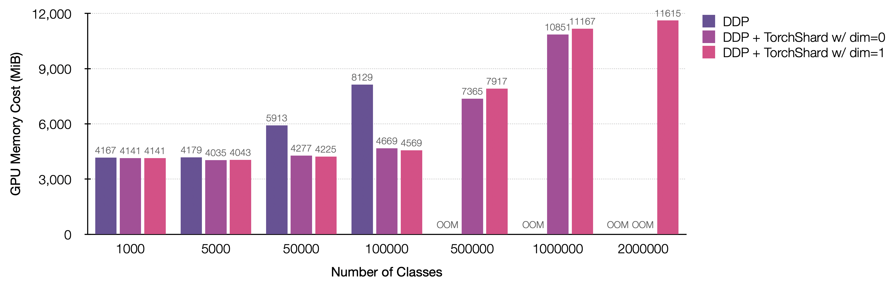

# Large-Scale Parallel Training on ImageNet

[[`projects/imagenet`](../../projects/imagenet)]

This note will show that how to adopt `torchshard` to current projects. 
We take the case of training ResNet-50 on ImageNet as our example.

## Coding

The official PyTorch training code is at [pytorch/examples/imagenet](https://github.com/pytorch/examples/tree/master/imagenet). 
Please follow its instruction and prepare the ImageNet dataset.
In this section, we will add some code to the `main.py` step-by-step.
Let's start.

First, import torchshard of course :bowtie:. 

```python
import torchshard as ts
```

Then, we need two additional flags for setting up our training.
`--enable-model-parallel` controls whether to use shard training mode or not. 
`--model-parallel-dim` controls which dimension along to split layers parameters.

```python
parser.add_argument('--enable-model-parallel', action='store_true',
                    help='enable training with torchshard')
parser.add_argument('--model-parallel-dim', default=None, type=int,
                    help='parallel dim: -1 | 1 | 0 | None')
```

Since TorchShard only works in a distributed manner, we need to initialize its process groups like `torch.distributed.init_process_group` of [DDP](https://pytorch.org/docs/stable/distributed.html#torch.distributed.init_process_group).
Here we make group size equal to the world size.

```python
if args.enable_model_parallel:
    # init model parallel processes and groups
    ts.distributed.init_process_group(group_size=args.world_size)
```

Next, we start to convert the model into a parallel version.
There is only one linear layer at the last position in ResNet.
So we can directly feed the whole model into the convert helper function.

```python
if args.enable_model_parallel:
    import resnet
    model = resnet.__dict__[args.arch](pretrained=args.pretrained)
    ts.nn.ParallelLinear.convert_parallel_linear(model, dim=args.model_parallel_dim)
    print("=> paralleling model '{}'".format(args.arch))
```

Don't forget the criterion part, i.e., loss function.

```python
if args.enable_model_parallel:
    criterion = ts.nn.ParallelCrossEntropyLoss().cuda(args.gpu)
```

When model parallel mode (TorchShard) and data-parallel mode (DDP) work together, we need to take care of input for the parallel layers.
Each parameter on each rank is different, and each training data on each rank is different, this is why we gather input before the parallel linear layer in the ResNet forward.

```python
x = ts.distributed.gather(x, dim=0) # gather input along the dim of batch size
x = self.fc(x)
```

Same, we gather target tensors before calculating loss values.

```python
output = model(images)
if args.enable_model_parallel:
    target = ts.distributed.gather(target, dim=0)
loss = criterion(output, target)
```

Now we have finished adding code for the shard training on ImageNet. 
Then we can scale it up with increasing the number of classes, i.e., the output feature dimension of the last fc layer.

## Performance

This section shows GPU memory cost with the standard ResNet training settings (i.e., input size 224 and batch size 256) under different parallel strategies.
Parallelism is with 8-way data parallel and N-way model parallel (N = the number of GPUs).

- Training ResNet-50 on 8 NVIDIA TITAN-XP (12196 MiB) GPUs for the number of classes &le; 1000000, 16 GPUs for 2000000.

<p align="center">
  
</p>

| number of classes | precision mode | batch size | number of GPUs | parallel dim | iteration time (s) |
| :---------------: |:-------------: | :--------: | :------------: | :----------: | :----------------: |
| 1000              | FP32           | 256        | 8              |  None        | 0.508 |
| 1000000           | FP32           | 256        | 8              | `0`          | 0.710 |
| 1000000           | FP32           | 256        | 8              | `1` or `-1`  | 0.578 |
| 2000000           | FP32           | 256        | 16             | `1` or `-1`  | 0.780 |

**Note**:
- The iteration time is sampled in the middle of an epoch training.
- The training speed can be boosted, by using AMP, if running on GPUs with [Tensor Cores](https://www.nvidia.com/en-us/data-center/tensor-cores/), such as NVIDIA V100 or A100. Currently, I have no these types of machine to benchmark out more results.

## Results

TorchShard has no accuracy loss.
We run 3 times for each experimental mode and average their best accuracies.

<!-- START TABLE -->
<table><tbody>
<!-- TABLE HEADER -->
<th valign="bottom">mode</th> <th valign="bottom">best accuracy@top1</th>
<!-- TABLE BODY -->
<tr><td align="left">DP</td><td align="center">75.90 &plusmn; 0.2</td></tr>
<tr><td align="left">DDP</td><td align="center">75.60 &plusmn; 0.3</td></tr>
<tr><td align="left">DDP + TorchShard</td> <td align="center">75.75 &plusmn; 0.2</td></tr>
</tbody></table>

**Note**:
The ResNet-50 top1 accuracy in [torchvision.models](https://pytorch.org/vision/stable/models.html#classification) is 76.130.
I cannot reproduce this result, maybe because there are some broken images in my training dataset, as shown in following logs.
If you can reproduce that official best accuracy, please help me out with updating this table.
It is my great pleasure.

```bash
/opt/conda/lib/python3.7/site-packages/PIL/TiffImagePlugin.py:802: UserWarning: Corrupt EXIF data.
Expecting to read 4 bytes but only got 0. warnings.warn(str(msg))
```

## Save and Load Checkpoints

It's super easy. Just warp up the PyTorch `state_dict()` using [`torchshard.collect_state_dict()`](../api/ts.md#collect_state_dict) and [`torchshard.relocate_state_dict()`](../api/ts.md#relocate_state_dict) to process the model `stat_dict()`.

- for saving

```python
state_dict = model.state_dict()
state_dict = ts.collect_state_dict(model, state_dict) # collect state_dict() across all ranks
if ts.distributed.get_rank() == 0:
    torch.save(state_dict, 'resnet50.pt')
```

- for loading

```python
if ts.distributed.get_rank() == 0:
    state_dict = torch.load('resnet50.pt')
state_dict = ts.relocate_state_dict(model, state_dict) # relocate state_dict() for all ranks
model.load_state_dict(state_dict)
```

<p><br/></p>

<p>&#10141; Back to the <a href="../">main page</a></p>
