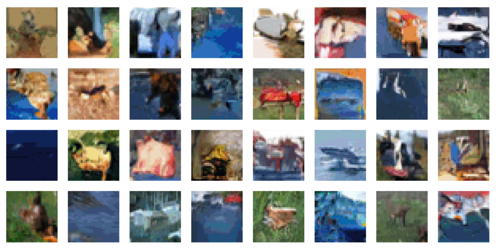

# Parallelizing Transformer to Scale-up minGPT Training

[[`projects/minGPT`](../../projects/minGPT)]

This note will walk throught the steps of scaling up [minGPT](https://github.com/karpathy/minGPT/blob/master/play_image.ipynb) with TorchShard.

## Preparation

minGPT encodes dataset into a low-dimensional codebook to narrow down the input sequence length.
We run the corresponding code to save the codebook via:

```python
···
with torch.no_grad():
    C = kmeans(px, ncluster, niter=8)
torch.save(C, 'c.pt')
···
```

This step helps us to make sure all the parallel process groups have a same codebook when we use DDP for training.

## Parallelism

The original minGPT trainer uses DP mode `torch.nn.DataParallel`.
At first, we adopt DDP in [minGPT/main.py](../../projects/minGPT/main.py).
Then we can parallelize four components of GPT:

- **Embedding Layer**.
We parallelize `torch.nn.Embedding` layer into `torchshard.nn.ParallelEmbedding` layer,
which also supports two parallel manners - row and column parallel.
Here we use its row parallel manner.
See [`self.tok_emb`](../../projects/minGPT/mingpt/model.py#L177-L178) code.

- **Self-Attention Module**.
The self-attention module contains four linear layers.
We parallelize former three layers in the column dimension and the last one in the row dimension.
See [`class ParallelCausalSelfAttention`](../../projects/minGPT/mingpt/model.py#L87) code.

- **MLP Module**.
The MLP module contains two linear layer.
We parallelize the first one in column and the second one in row.
See [`self.mlp`](projects/minGPT/mingpt/model.py#L149-L154) code.

- **Cross-Entropy Loss**.
The minGPT is trained with cross-entropy loss.
We parallelize the linear layer of the decoder head with the column parallel dimension.
See [`self.head`](../../projects/minGPT/mingpt/model.py#L189) code.
Furthermore, its following module is the cross-entropy loss function.
We make loss parallel as well.
See [`loss function`](../../projects/minGPT/mingpt/model.py#L301) code.

## Mixed Key-Query-Value Layer

We fire key, query and value tensors from a single linear layer.
This is different from the original implementation, which use three isolated layers.
The mixed key-query-value layer is friendly for model parallel manner because it doesn't hurt outputs, gradients, and attention matrix.
In contrast, the implementation of using three isolated layers will hurt the attention matrix order and bring the chaos to the learning.

```python
""" 
Original Implementation in minGPT 
"""
# calculate query, key, values for all heads in batch and move head forward to be the batch dim
k = self.key(x).view(B, T, self.n_head, C // self.n_head).transpose(1, 2) # (B, nh, T, hs)
q = self.query(x).view(B, T, self.n_head, C // self.n_head).transpose(1, 2) # (B, nh, T, hs)
v = self.value(x).view(B, T, self.n_head, C // self.n_head).transpose(1, 2) # (B, nh, T, hs)

""" 
TorchShard Implementation
"""
# calculate query, key, values for all heads in batch and move head forward to be the batch dim
kqv = self.kqv(x).view(B, T, self.n_head, 3 * (C // self.n_head)) # (B, nh, T, 3 * hs)
k, q, v = ts.slice(kqv, 3, dim=-1, contiguous=True) # 3 x (B, nh, T, hs)
k = k.transpose(1, 2)
q = q.transpose(1, 2)
v = v.transpose(1, 2)
```

## Performance

| n-layer | n-head | n-embd | number of parameters |  DDP |  AMP | ZeRO | TorchShard | TorchShard + AMP |
|:-------:|:------:|:------:|:--------------------:|:----:|:----:|:----:|:----------:|:----------------:|
|    12   |    8   |   256  |     1.000166e+07     | 3297 | 3143 | 3253 |    1315    |       1281       |
|    24   |    8   |   256  |     1.947878e+07     | 5451 | 5213 | 3253 |    1733    |       1649       |
|    32   |    8   |   256  |     2.579686e+07     | 6835 | 6629 | 5293 |    2007    |       1897       |
|    32   |    8   |   512  |     1.019254e+08     | 9445 | 8995 | 6677 |    2603    |       2345       |
|    48   |    8   |   512  |     1.523635e+08     |  OOM |  OOM |  OOM |    3475    |       3071       |
|    64   |    8   |   512  |     2.028017e+08     |  OOM |  OOM |  OOM |    4339    |       3805       |
|    64   |   32   |  1024  |     8.082565e+08     |  OOM |  OOM |  OOM |    10501   |       9523       |

As shown in the above table, we progressively increase the number of self-attention layers and the size of embedding.
The input size is 32 x 32 and the batch size is 16.
The official implementation uses 128 batch size with 8 32GB Tesla V100 GPUs.
Here we use 8 NVIDIA TITAN-XP (12196 MiB) GPUs.
We reduce the batch size and keep 1-way data-parallel.
This means 8 GPUs are in a same model parallel group with same input data.
So the parallelism is with 1-way data parallel and 8-way model parallel.
The following figure shows that TorchShard is more efficient than other techniques.

<p align="center">
  
</p>

**Notes**:
Since dropout ratios are set in zero for all layers, there is no need to set specific radom seed for each model group.
But if you set dropout ratios with non-zero numbers, please refer to more details about random number generation in the MLP paper.

## Result

Let's check out the result after training GPT with TorchShard.
The script is `valid.ipynb`, which is just copied from [play_image.ipynb](https://github.com/karpathy/minGPT/blob/master/play_image.ipynb).

<p align="center">
  
</p>

TorchShard works well. :icecream:

<p><br/></p>

<p>&#10141; Back to the <a href="../">main page</a></p>
